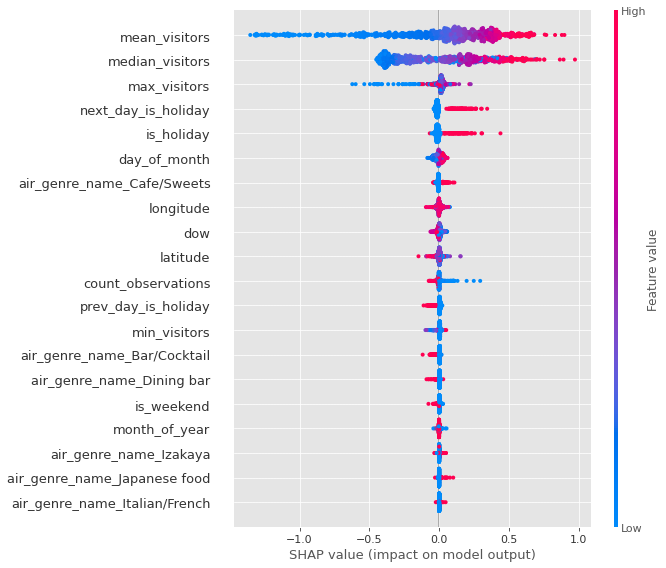

https://www.kaggle.com/c/recruit-restaurant-visitor-forecasting

#### 特徴

- 消費者需要予測
- 扱うデータの種類 テーブルデータ>時系列
- size 数十万レコード*7テーブル
- タスクの種類 回帰問題
- 開催期間 数年前

- 目的変数：特定の日付の来訪者数
- 指標：RMSE

#### Score

|       提出ファイル       |       詳細       |       Private Leaderboard       | Rank |
| ---------------------- | ---------------------- | ---------------------- | ---------------------- |
|  2021-08-13_23-03-27.csv  |  baseline  | 0.72230 | 1920/2148 |
|  2021-08-14_17-31-27.csv  |  クリッピングされた目的変数でリトライ | 0.72007 | - |
|  2021-08-14_22-44-00.csv  |  cvしてパラメータチューニング | 0.74184  | - |
|  2021-08-15_14-27-31.csv  |  再度パラメータチューニング(やり直し) | 0.72196 | - |
|  2021-08-15_16-27-35.csv  |  month_of_year | 0.72597 | - |
|  2021-08-15_18-46-11.csv  |   ['air_store_id', 'dow']のgroupby統計量min,max,mean,count,median追加 | 0.54999 | - | 
|  2021-08-15_19-12-55.csv  |  cvとって単純にtrain_test_splitでチューニング | 0.54618 | - |
|  csv  |  make | 0 | - |
|  csv  |  make | 0 | - |
|  csv  |  make | 0 | - |
|  csv  |  make | 0 | - |

 

#### モデルの観察
 

0.7259→0.54999

新しく作成したmean_visitors,median_visitors,max_visitorsがTOP3に入っている

 

 
学習・推論ともに同様の特徴量が重視されている
 

#### Kernel 2/10
- 8th solution
- simple-xgboost

#### discussion

